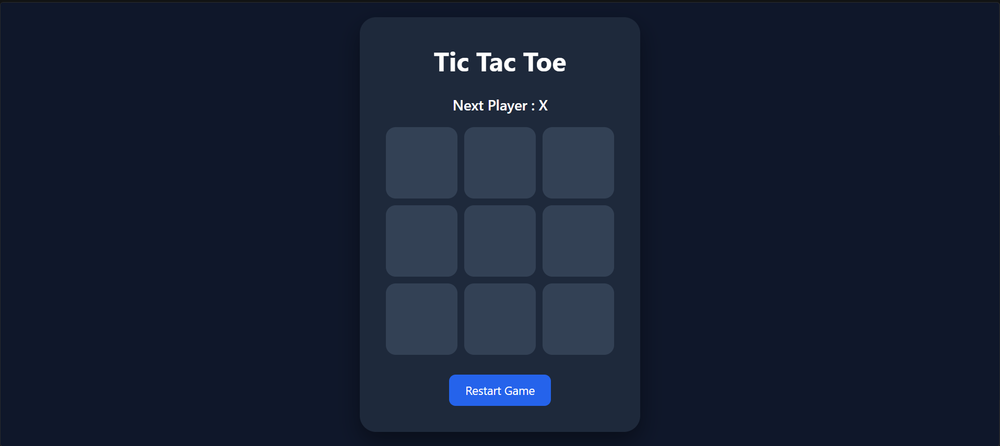
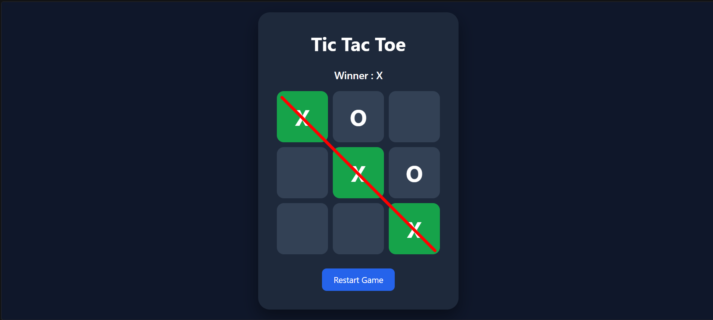

# 🎮 Tic Tac Toe Game

A modern and interactive **Tic Tac Toe** game built with **React** and **Vite**. The application features a clean UI, move history, winner detection with a strike-through line, draw detection, and the ability to restart the game.

---

## 🚀 Features

- ✅ Two-player Tic Tac Toe game
- ✅ Winner detection
- ✅ Red strike-through line on winning combination
- ✅ Draw detection
- ✅ Move history (Time Travel)
- ✅ Restart game functionality
- ✅ Responsive and modern UI
- ✅ Built using React Hooks (`useState`)

---

## 🛠️ Tech Stack

- **React.js**
- **Vite**
- **JavaScript (ES6+)**
- **CSS3**

---

## 📸 Screenshots

### Game Board

```md

```
```md

```

---

## 📂 Project Structure

```text
tic-tac-toe-react/
│
├── public/
├── src/
│   ├── App.jsx
│   ├── App.css
│   ├── main.jsx
│   └── assets/
│
├── index.html
├── package.json
├── package-lock.json
├── vite.config.js
├── .gitignore
└── README.md
```

---

## ⚙️ Installation and Setup

### 1. Clone the Repository

```bash
git clone https://github.com/amanchougule09/tic-tac-toe-react.git
```

### 2. Navigate to the Project Directory

```bash
cd tic-tac-toe-react
```

### 3. Install Dependencies

```bash
npm install
```

### 4. Run the Development Server

```bash
npm run dev
```

Open your browser and visit:

```text
http://localhost:5173
```

---

## 🏗️ Build for Production

```bash
npm run build
```

To preview the production build:

```bash
npm run preview
```

---

## 🎯 Future Enhancements

- Single Player Mode (AI)
- Difficulty Levels
- Sound Effects
- Scoreboard
- Dark/Light Theme Toggle
- Online Multiplayer Support

---

## 👨‍💻 Author

**Aman Chougule**

- GitHub: https://github.com/amanchougule09

---

## ⭐ Show Your Support

If you like this project, please consider giving it a **⭐ Star** on GitHub.

---

## 📄 License

This project is licensed under the **MIT License**.
